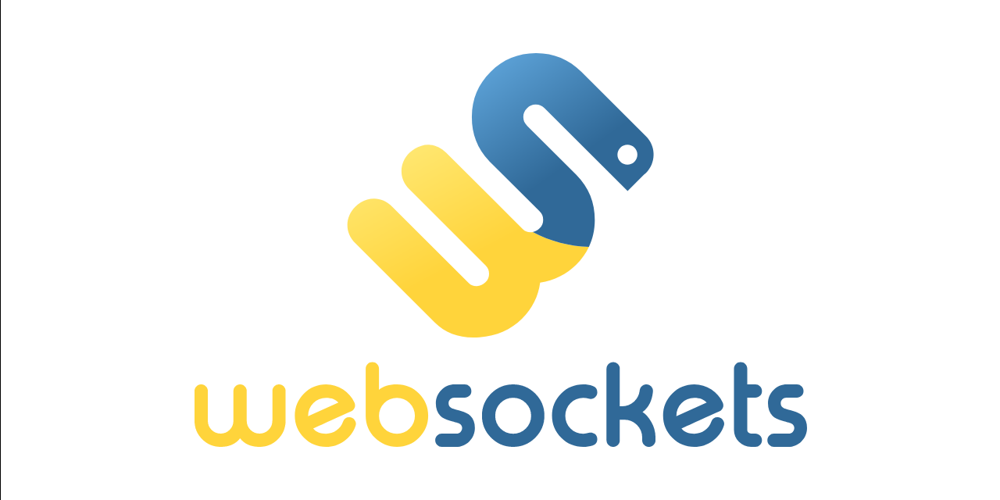

  
  <h1 align="center" style="margin: 0 auto 0 auto;">Websocket</h1>
  <h5 align="center" style="margin: 0 auto 0 auto;">A websocket server for managing messages</h5>

​

  
  
  
  
  

  
  
  
  

- [Documentation](#Documentation)
- [Supported versions for releases](#Supported-versions-for-releases)

# Websockets
This project has 2 main microservices which are one is an API in which you can manage the topics and messages queue.
There are a lot of improvements that can be made but the focus of this project is to have the websocket working as expected.

# Documentation
The documentation can be found by clicking [here](https://github.com/dmtzs/WebSockets/wiki)

# Supported versions for releases
To see the releases supported versions please click [here]() to see the supported ones and unsupported ones.